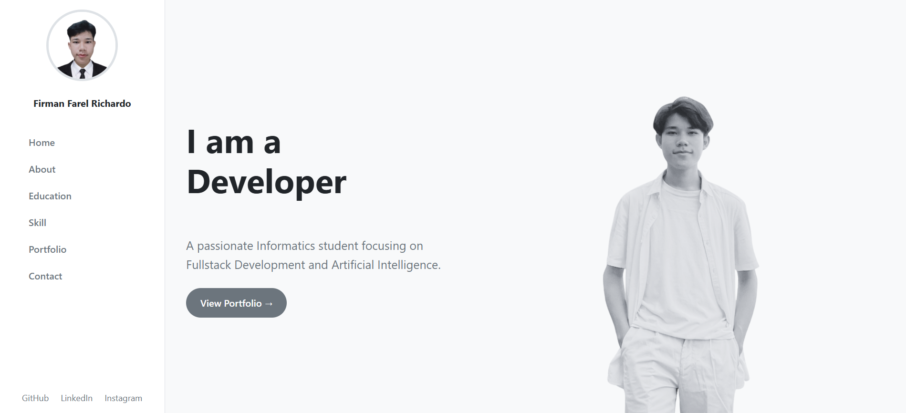
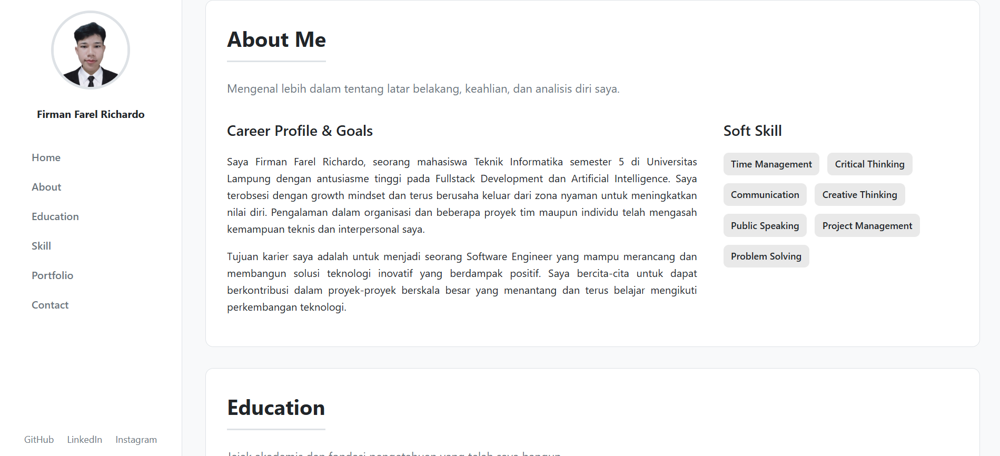
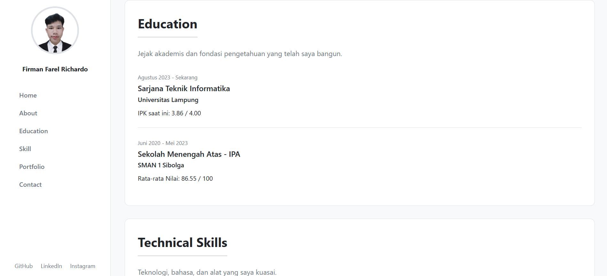
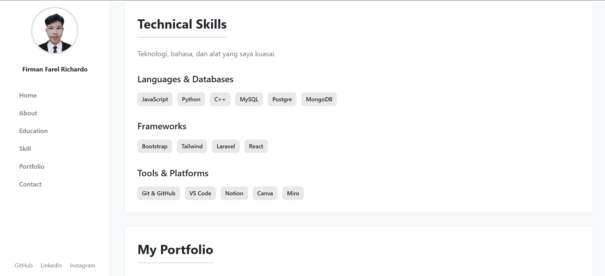
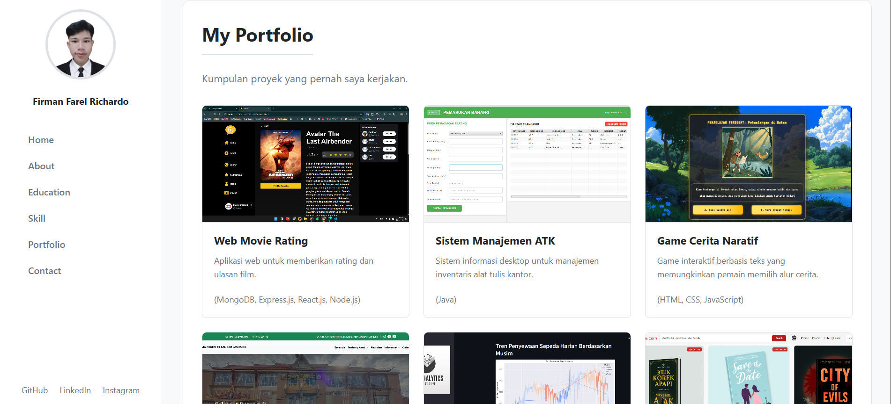
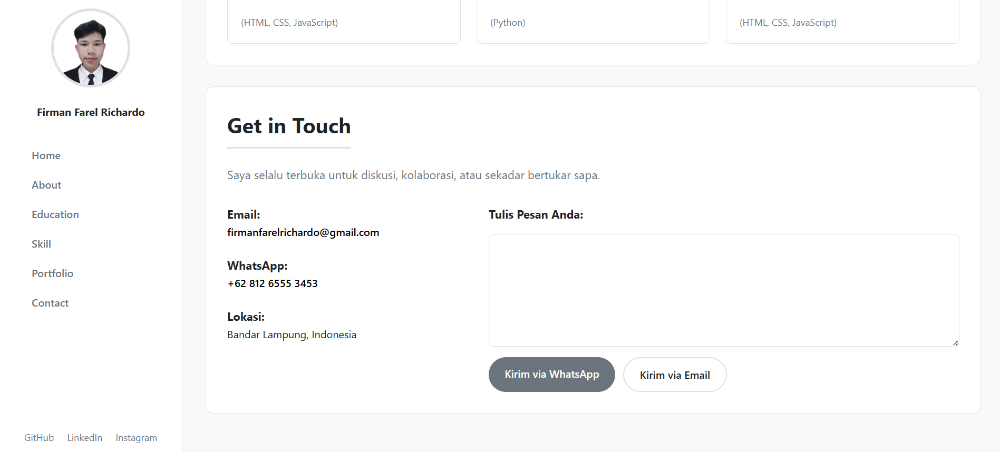

# Portofolio — Firman Farel Richardo

Halaman portofolio statis yang dibuat dengan HTML & CSS. Menampilkan profil singkat, pendidikan, skill, daftar proyek, dan kontak. Tata letak menggunakan sidebar navigasi yang responsif dan area konten utama dengan section: Home, About, Education, Skill, Portfolio, Contact.

## Isi Repository
* `index.html` — struktur halaman (sidebar + main content)
* `style.css` — seluruh styling (variables, sidebar, hero, section card, responsive)
* `assets/` — gambar dan aset proyek (termasuk `profile.jpg` dan `bw.png`)
* `screenshot/` — gambar-gambar screenshot halaman

## Fitur Utama 
* Sidebar tetap (fixed) berisi foto, nama, navigasi, dan tautan sosial.
* Section "Home" (hero) memenuhi area layar (full-height), menampilkan judul, deskripsi, tombol aksi, dan gambar hero.
* Section "About" berisi profil & soft-skill dalam layout 2 kolom.
* Section "Education" menampilkan riwayat pendidikan.
* Section "Skill" menampilkan badges untuk languages, frameworks, tools.
* Section "Portfolio" menampilkan project-card grid dengan gambar dan deskripsi.
* Section "Contact" menampilkan detail kontak dan form pesan interaktif (HTML/CSS/JS).
* Responsive: media query untuk ukuran <= 992px menumpuk sidebar dan layout lainnya.

## Cara Menjalankan
1.  Pastikan struktur folder sudah benar (terutama folder `assets/` dan `screenshot/`).
2.  Buka `index.html` langsung di browser.

---

## Screenshot Halaman

Berikut adalah tampilan dari setiap bagian utama halaman portofolio.

### 1. Halaman Utama (Hero)

### 2. Tentang Saya (About Me)

### 3. Pendidikan (Education)

### 4. Keahlian (Technical Skills)

### 5. Portofolio (My Portfolio)

### 6. Kontak (Get in Touch)

---

## Struktur Singkat HTML
* `aside.sidebar`
    * `img.profile-img`
    * `h1.profile-name`
    * `nav.main-nav` > `a.nav-link` (Home, About, Education, Skill, Portfolio, Contact)
    * `.sidebar-footer` (tautan sosial)
* `main.main-content`
    * `section#home.hero-section` (hero-text + hero-image-container)
    * `section#about.card`
    * `section#education.card`
    * `section#skill.card`
    * `section#portfolio.card`
    * `section#contact.card`

## Lisensi & Kontak
Proyek ini untuk keperluan portofolio pribadi. Untuk pertanyaan atau kolaborasi, lihat bagian Contact di halaman atau gunakan tautan sosial di sidebar.