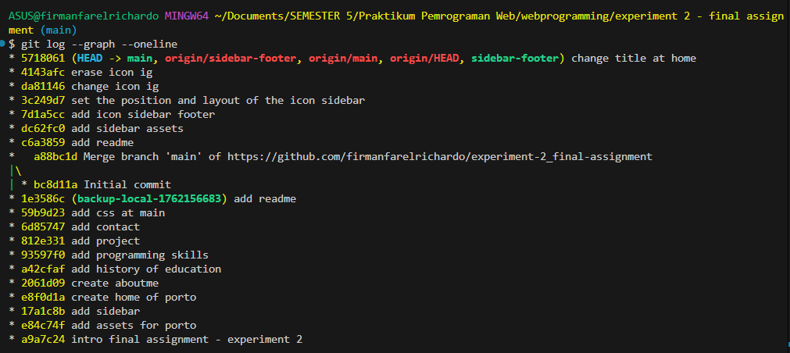
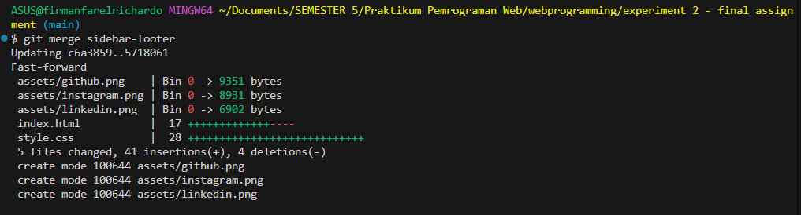

# Website Portofolio Pribadi - Firman Farel Richardo

Ini adalah *tugas akhir percobaan kedua* untuk mata kuliah Praktikum Pemrograman Web (Semester 5). Proyek ini merupakan website portofolio pribadi statis yang dibuat untuk menampilkan profil, riwayat pendidikan, keahlian, dan proyek-proyek yang pernah dikerjakan.

Proyek ini dibuat berdasarkan *file* `index.html` dan `style.css` yang telah disiapkan.

---

## Tautan Repositori

Kamu dapat mengakses repositori publik proyek ini di:
[https://github.com/firmanfarelrichardo/experiment-2_final-assignment](https://github.com/firmanfarelrichardo/experiment-2_final-assignment)

---

## Pratinjau Proyek

Berikut adalah tampilan dari beberapa bagian proyek yang ada di dalam portofolio:

| Web Movie Rating | Sistem Manajemen ATK | Game Cerita Naratif |
| :---: | :---: | :---: |
|  |  |  |

| Web Profil Sekolah | Analisis Data (ML) | LiteraStore |
| :---: | :---: | :---: |
|  |  |  |
---

## Teknologi yang Digunakan

* **HTML5:** Digunakan untuk membangun struktur dan kerangka konten website.
* **CSS3:** Digunakan untuk *styling*, tata letak (layout), dan membuat website menjadi responsif.

---

## Instalasi dan Penggunaan

Karena ini adalah website statis, tidak diperlukan proses instalasi yang kompleks.

1.  **Clone repository ini:**
    ```bash
    git clone https://github.com/firmanfarelrichardo/experiment-2_final-assignment.git
    ```
2.  **Masuk ke direktori proyek:**
    ```bash
    cd experiment-2_final-assignment
    ```
3.  **Buka file `index.html`:**
    Buka file `index.html` di browser pilihan kamu (misalnya Google Chrome, Firefox, atau Edge) untuk melihat website secara lokal.

---

## Workflow Git yang Diterapkan

Proyek ini dikerjakan dengan mengikuti alur kerja (workflow) Git yang terstruktur untuk mengelola riwayat perubahan secara efektif:

1.  **Inisialisasi Git:**
    * Proyek diinisialisasi sebagai repositori Git baru di direktori lokal menggunakan perintah `git init`.

2.  **Commit Bertahap (Atomic Commits):**
    * Setiap *section* utama dari website (seperti Home, About, Education, Skill, Portfolio, Contact) dibuat dan di-*commit* secara terpisah.
    * Tujuannya adalah agar setiap *commit* fokus pada satu penambahan fitur spesifik, sehingga riwayatnya mudah dilacak (contoh: `git commit -m "add: create home of porto"`, `git commit -m "add: create aboutme"`).

3.  **Penggunaan Branch (Branching):**
    * Sebuah *branch* baru bernama `sidebar-footer` dibuat untuk melakukan eksperimen *styling* pada bagian *footer* (ikon sosial media) di *sidebar*.
    * Perintah yang digunakan:
        ```bash
        git branch sidebar-footer
        git checkout sidebar-footer
        ```
    * Pekerjaan *styling* baru dilakukan di dalam *branch* ini agar tidak mengganggu kode utama yang stabil di *branch* `main`.

4.  **Merge Branch:**
    * Setelah proses *styling* di *branch* `sidebar-footer` selesai dan dipastikan berfungsi dengan baik, perubahan tersebut digabungkan kembali ke *branch* `main`.
    * Perintah yang digunakan:
        ```bash
        git checkout main
        git merge sidebar-footer
        ```

5.  **Push ke GitHub:**
    * Setelah semua fitur dan *styling* dianggap stabil di *branch* `main`, keseluruhan proyek di-*push* ke repositori *remote* di GitHub untuk disimpan dan dibagikan.
    * Perintah yang digunakan: `git push origin main`.

6.  **Pembuatan README.md:**
    * File `README.md` ini (yang sedang kamu baca) dibuat untuk memberikan dokumentasi informatif mengenai deskripsi proyek, teknologi, langkah penggunaan, dan alur kerja Git yang diterapkan.

---

## Riwayat Git Log

Berikut adalah *screenshot* dari perintah `git log --graph --oneline` yang menunjukkan riwayat *commit* serta alur kerja *branching* dan *merge* yang telah dilakukan:


Berikut adalah *screenshot* dari perintah `git merge sidebar-footer` yang menunjukkan hasil *merge* yang telah dilakukan:

